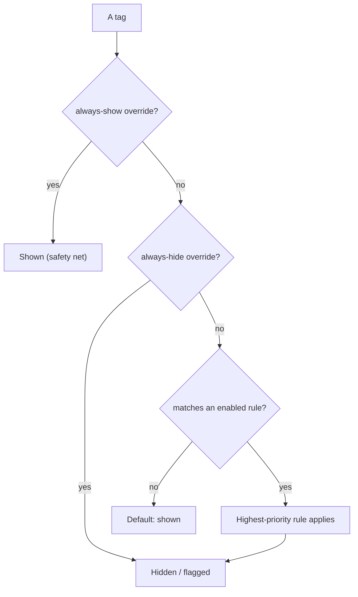
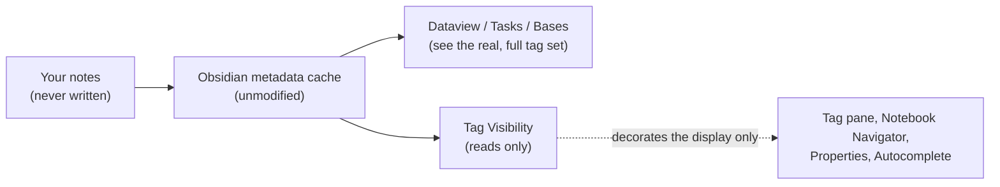

  <picture>
    <source media="(prefers-color-scheme: dark)" srcset="https://raw.githubusercontent.com/prisant-labs/obsidian-tag-visibility/main/docs/assets/header-dark.png">
    
  </picture>

# Tag Visibility

**A vault-wide tag visibility engine for Obsidian.** Hide, flag, and surface noisy tags across the places they actually appear, without modifying a single note.

> Display-only. File-safe. Fully reversible.

  <a href="https://github.com/prisant-labs/obsidian-tag-visibility/issues/new?labels=bug">Report a bug</a>
  &nbsp;&middot;&nbsp;
  <a href="https://github.com/prisant-labs/obsidian-tag-visibility/issues/new?labels=enhancement">Request a feature</a>
  &nbsp;&middot;&nbsp;
  <a href="https://github.com/prisant-labs/obsidian-tag-visibility/discussions">Ask a question</a>

  
  
  
  

  
  
  

  
  
  
  

  <a href="#about">About</a> &middot;
  <a href="#getting-started">Install</a> &middot;
  <a href="#usage">Usage</a> &middot;
  <a href="#scopes">Scopes</a> &middot;
  <a href="#safety-contract">Safety</a> &middot;
  <a href="#compatibility">Compatibility</a> &middot;
  <a href="#roadmap">Roadmap</a> &middot;
  <a href="#license">License</a>

---

<strong>Table of contents</strong>

- [About](#about)
  - [Key features](#key-features)
- [Getting started](#getting-started)
  - [Prerequisites](#prerequisites)
  - [Installation](#installation)
- [Usage](#usage)
  - [Quick start](#quick-start)
  - [The Tag Visibility panel](#the-tag-visibility-panel)
  - [Scopes](#scopes)
  - [Per-tag overrides](#per-tag-overrides)
  - [Presets](#presets)
  - [Commands](#commands)
  - [Modes](#modes)
  - [Settings](#settings)
  - [Files and storage](#files-and-storage)
- [Safety contract](#safety-contract)
- [Compatibility](#compatibility)
- [Performance](#performance)
- [Roadmap](#roadmap)
- [Non-goals](#non-goals)
- [Contributing](#contributing)
- [License](#license)
- [Support](#support)
- [Acknowledgments](#acknowledgments)

---

## About

Tag Visibility gives you a rule engine that controls which tags appear across Obsidian's UI. Your notes are never touched. Disabling or uninstalling the plugin restores every tag immediately, because nothing was ever written to your files.

> **How does it work?** [How Tag Visibility Works](docs/HOW-IT-WORKS.md) is a plain-language explainer with an FAQ, written for both everyday users and engineers.

The heart of v1.0 is the **Tag Visibility panel**: a real, dockable workspace leaf (not a settings screen) where you see every change land live. Open it beside the native tag pane and your loop becomes a single continuous glance: edit a rule on one side, watch tags hide or flag on the other, in the same breath.

<!-- IMAGE PENDING (capture): docs/assets/hero-pane-beside-tagpane.gif - the Tag Visibility panel docked beside the native tag pane, mid-edit -->

### Key features

- **Display-only and reversible.** Tags are hidden or flagged in the UI only; note content is never modified, and turning the plugin off restores everything instantly.
- **The Tag Visibility panel.** A dockable leaf with a virtualized tag table, an inline rule editor, live preview, bulk actions, and per-row "why is this hidden?" diagnostics.
- **Side-by-side loop.** One command docks the panel beside the native tag pane, so a rule edit and its effect are a single glance apart.
- **Four scopes, independently switchable.** Tag pane, Notebook Navigator, Properties, and Autocomplete, each with its own kill switch.
- **Per-tag overrides.** Pin any single tag to always-show (the safety net) or always-hide, ahead of every rule.
- **Five presets plus custom rules.** Regex, frequency, or list rules, with a live preview as you type.
- **Plays well with others.** Dataview, Tasks, and Bases see the real tag set; Tag Wrangler, Style Settings, and Notebook Navigator are optional enhancements.

(<a href="#readme-top">back to top</a>)

## Getting started

### Prerequisites

- Obsidian 1.9.10 or newer.
- Optional companions that unlock extra integration when present: [Tag Wrangler](https://github.com/pjeby/tag-wrangler) (rename delegation), [Style Settings](https://github.com/mgmeyers/obsidian-style-settings) (GUI styling), and [Notebook Navigator](https://github.com/johansan/notebook-navigator) (tag-tree scope). None is required.

### Installation

**BRAT (until the directory listing is live):**

1. Install the BRAT plugin from the Obsidian Community Plugins directory.
2. In BRAT settings, click **Add Beta Plugin** and add `https://github.com/prisant-labs/obsidian-tag-visibility`.
3. Pick the latest release tag when prompted.
4. Enable Tag Visibility under Community Plugins.

BRAT offers updates automatically whenever a new beta is published.

**Manual:**

1. Download `main.js`, `manifest.json`, and `styles.css` from the [latest release](https://github.com/prisant-labs/obsidian-tag-visibility/releases).
2. Copy them to `<your-vault>/.obsidian/plugins/tag-curator/`.
3. Reload Obsidian and enable Tag Visibility under Community Plugins.

(<a href="#readme-top">back to top</a>)

## Usage

### Quick start

1. Enable Tag Visibility. The welcome modal opens once: it states the file-safe contract, then offers **Start hiding tags** (apply rules normally) or **Start in preview mode** (flag matched tags instead of hiding them).
2. Run **Tag Visibility: Open beside the tag pane** from the command palette (Cmd/Ctrl+P). The Tag Visibility panel and the native tag pane sit side by side.
3. Click `+ New rule`, give it a name, pick a Type (Pattern match / Count threshold / Specific tags), and watch the live preview and the real tag pane react as you type.
4. If a rule catches one tag too many, find its row and pin it to **always-show**. It pops back and is safe from every rule.
5. The status bar shows the current state. Click it to open the panel filtered to hidden tags.
6. If anything looks wrong: **Settings > General > Run panic disable**, or run **Tag Visibility: Panic disable** from the command palette. Every effect across every scope is removed instantly; nothing in your notes changes.

### The Tag Visibility panel

The Tag Visibility panel is where the work happens. It holds:

- **The tag table.** Every tag in your vault with its count, first and last seen, source (frontmatter or inline), per-scope visibility, and the rule (if any) affecting it. Sortable, searchable, virtualized for large vaults.
- **Filter chips.** One-click filters: Hidden, Flagged, Orphans, Frontmatter, Inline, Unreviewed, By rule.
- **The inline rule editor.** Rules show as cards; click a card to edit in place, or `+ New rule` to create one. The editor never leaves the panel, so you never lose sight of your tags.
- **Live preview.** As you type a rule, the affected-tags list updates immediately, and so does the real tag pane beside it.
- **Bulk actions.** Select several tags, then hide, unhide, flag, add a description, or send them to Tag Wrangler in one action.
- **Per-row diagnostics.** On any row, ask "why is this hidden?" and Tag Visibility names the exact preset, rule, or override responsible. A tag is never hidden without a traceable reason.

Two commands open it:

- **Tag Visibility: Open the panel** opens it on its own.
- **Tag Visibility: Open beside the tag pane** opens the panel and the native tag pane side by side, arranged for you in one move. This is the side-by-side loop that is the whole point of v1.0.

You can also open it from the status bar, or from Settings.

### Scopes

A scope is a place in Obsidian where tags appear and where Tag Visibility can act. v1.0 covers the four surfaces where tags actually render:

- **Tag pane** - Obsidian's native tag list.
- **Notebook Navigator** - the tag tree in the Notebook Navigator plugin, when present. Runtime interop only; a silent no-op when Notebook Navigator is absent.
- **Properties** - frontmatter tags rendered in the Properties panel.
- **Autocomplete** - the tag suggestions you get while typing, so you are not offered a tag you just hid.

By default, hiding a tag hides it consistently across all four places. Each scope is **independent and reversible on its own**: go to **Settings, then Scopes**, and toggle any scope off with its per-scope kill switch. If a single surface ever misbehaves, switch off just that scope; the others keep working and the plugin stays on.

<!-- IMAGE PENDING (capture): docs/assets/settings-scopes.png - Settings > Scopes with the four scope toggles -->

### Per-tag overrides

Sometimes you do not want a whole rule, just one specific tag handled a certain way. That is an **override**, a per-tag decision that beats every rule:

- **Always show** pins a tag visible no matter what any rule says. If a rule hides one tag too many, pin that tag to always-show and move on. Always-show wins over everything, so a pinned tag can never be hidden by accident.
- **Always hide** pins a single tag out of sight without writing a rule for it.

Set an override from a tag's row in the Tag Visibility panel. Overrides persist and resolve ahead of rules.

Putting overrides, rules, and the default together, here is how Tag Visibility decides whether any given tag is shown:

<!-- These diagrams render natively on GitHub. Before the directory submission, confirm Mermaid renders in Obsidian's in-app plugin browser; if it shows as raw code there, swap this and the Safety-contract diagram for committed SVGs. -->

### Presets

Five built-in presets ship enabled or disabled to taste:

- Hide hex color codes such as `#FFAA00` or `#abcdef` (often imported from web clippings). On by default.
- Hide URL anchor fragments such as `#top`, `#section-3`, or `#sidebar`. On by default.
- Hide single-character tags such as `#a` or `#x`.
- Hide purely numeric tags.
- Hide orphan tags (used in one or fewer notes).

You can also write your own rules: regex patterns, frequency thresholds, or explicit tag lists, with a live preview as you type.

### Commands

Obsidian lists these under the **Tag Visibility** prefix in the command palette:

- Tag Visibility: Toggle enable
- Tag Visibility: Panic disable (remove all DOM effects now)
- Tag Visibility: Toggle preview mode
- Tag Visibility: Open the panel
- Tag Visibility: Open beside the tag pane
- Tag Visibility: Rescan vault tags

### Modes

- Default: rules hide matching tags.
- Preview mode: rules visibly flag matching tags instead of hiding them, so you can see a rule's impact before committing.

### Settings

Settings is set-once config, not a workbench. The work happens in the Tag Visibility panel. Settings holds:

- **General**: the safety row (panic disable), master enable, preview mode, and a button to open the panel.
- **Scopes**: a per-scope kill switch for each of the four scopes.
- **Presets** and **Custom rules**: manage the rule set.
- **Integrations**: Tag Wrangler, Style Settings, and Notebook Navigator status.
- **Advanced**: index maintenance, sidecar debounce, debug logging.

Profiles and Aliases tabs are present as placeholders for later releases (v1.1 and v1.2).

### Files and storage

What lives in `.obsidian/plugins/tag-curator/`:

- `data.json`: settings, presets, custom rules, and per-tag overrides.
- `tags.json`: per-tag metadata (count, first seen, last seen, source).

Both are pretty-printed JSON for easy git diffing.

(<a href="#readme-top">back to top</a>)

## Safety contract

Tag Visibility never modifies note content. It does not patch `metadataCache.getTags()` or any other internal Obsidian API. Dataview, Tasks, and Bases see the real, unfiltered tag data. This is architecture, not a promise: the plugin contains no note-writing code. Every write it makes targets its own two files (`data.json` and `tags.json`); it never calls a note-mutating API such as `vault.modify`, `fileManager.renameFile`, or `processFrontMatter`. The one note-changing action, renaming a tag, is delegated to Tag Wrangler on your explicit request.

Tag Visibility makes no network requests of any kind: nothing is fetched, nothing is sent, and there is no telemetry.

If the plugin behaves unexpectedly, run **Tag Visibility: Panic disable** from the command palette. This is a one-shot action that produces the "off" state: every Tag Visibility display effect is removed immediately across all scopes, the plugin disables itself, and a persistent banner shows "Tag Visibility is off" at the top of every Tag Visibility surface until you re-enable. The same banner shows "Preview mode is on" whenever preview mode is active, so you always know the plugin's current state.

(<a href="#readme-top">back to top</a>)

## Compatibility

Tag Visibility is display-only and file-safe, so it plays well with the rest of your tag ecosystem.

- **Dataview, Tasks, and Bases**: unaffected. Because Tag Visibility only changes how tags render and never patches the metadata cache or note content, every metadata-cache consumer sees the full, unfiltered tag set. Your queries, indexes, and results are exactly what they would be without Tag Visibility installed.
- **Tag Wrangler** (the rename surface): Tag Visibility delegates renaming to Tag Wrangler and never writes note content itself. When Tag Wrangler is enabled, the Tag Visibility panel adds a per-row "Rename with Tag Wrangler" menu item and a bulk "Send to Tag Wrangler" action. When it is not installed, those actions are hidden or disabled and everything else still works.
- **Style Settings** (optional): install it to customize Tag Visibility's hidden- and flagged-tag styling through a GUI. Tag Visibility ships built-in defaults for every themeable value, so styling works fully without Style Settings.
- **Notebook Navigator** (optional): when present, Tag Visibility decorates Notebook Navigator's tag tree through runtime interop only. There is no source coupling between the two (Notebook Navigator is GPL-3.0, Tag Visibility is Apache-2.0); Tag Visibility targets the rendered rows from the outside and is a no-op when Notebook Navigator is absent.

None of these plugins is required. Tag Visibility works fully standalone; each integration is an optional enhancement that activates only when the partner plugin is enabled.

## Performance

For typical vaults (under 10k notes, under 1,500 unique tags), Tag Visibility's overhead is imperceptible. Each scope observer is scoped to its container, coalesced through `requestAnimationFrame`, and applies class-based hiding rather than DOM removal.

(<a href="#readme-top">back to top</a>)

## Roadmap

- **v1.0** (current): the Tag Visibility panel, the open-beside-the-tag-pane command, four scopes (tag pane, Notebook Navigator, Properties, Autocomplete) with per-scope kill switches, per-tag overrides, five presets, custom rules, thin Settings, Tag Wrangler delegation, Style Settings registration, and the trust layer (welcome modal, state banner, panic disable, status bar).
- **v1.1** (planned): aliases / display-merge, stale and near-duplicate detection, suggested-merges panel, inbox mode, graph view scope.
- **v1.2** (planned): profiles, export / import, community rule packs, compound criteria (AND/OR/NOT), drag-to-reorder rules.
- **v2.0+**: Bases scope, larger-vault storage, localization.

See the [open issues](https://github.com/prisant-labs/obsidian-tag-visibility/issues) for the live list.

(<a href="#readme-top">back to top</a>)

## Non-goals

- Modifying note content (use Tag Wrangler).
- Coloring tags (use Colored Tags Wrangler).
- Replacing the file explorer (Notebook Navigator's role).
- Filtering query results in Dataview, Tasks, or Bases.
- Telemetry of any kind.

## Contributing

Tag Visibility is open source under Apache 2.0, and issues and pull requests are welcome.

- **Found a bug?** [Open a bug report](https://github.com/prisant-labs/obsidian-tag-visibility/issues/new?labels=bug).
- **Have an idea?** [Request a feature](https://github.com/prisant-labs/obsidian-tag-visibility/issues/new?labels=enhancement) or start a [discussion](https://github.com/prisant-labs/obsidian-tag-visibility/discussions).
- **Sending a PR?** Fork the repo, branch from `main`, keep `npm run lint && npm run typecheck && npm test && npm run build` green, and use [Conventional Commits](https://www.conventionalcommits.org/) for your messages.

(<a href="#readme-top">back to top</a>)

## License

Distributed under the Apache License 2.0. See [`LICENSE`](LICENSE) for details.

## Support

- **Issues:** https://github.com/prisant-labs/obsidian-tag-visibility/issues
- **Discussions:** https://github.com/prisant-labs/obsidian-tag-visibility/discussions
- **Repository:** https://github.com/prisant-labs/obsidian-tag-visibility

## Acknowledgments

- The [Obsidian](https://obsidian.md) team and the plugin developer community.
- [Tag Wrangler](https://github.com/pjeby/tag-wrangler), [Notebook Navigator](https://github.com/johansan/notebook-navigator), and [Style Settings](https://github.com/mgmeyers/obsidian-style-settings), the companions Tag Visibility composes with.
- [BRAT](https://github.com/TfTHacker/obsidian42-brat) for beta distribution.
- README structure inspired by [Best-README-Template](https://github.com/othneildrew/Best-README-Template) and [amazing-github-template](https://github.com/dec0dOS/amazing-github-template).

(<a href="#readme-top">back to top</a>)

