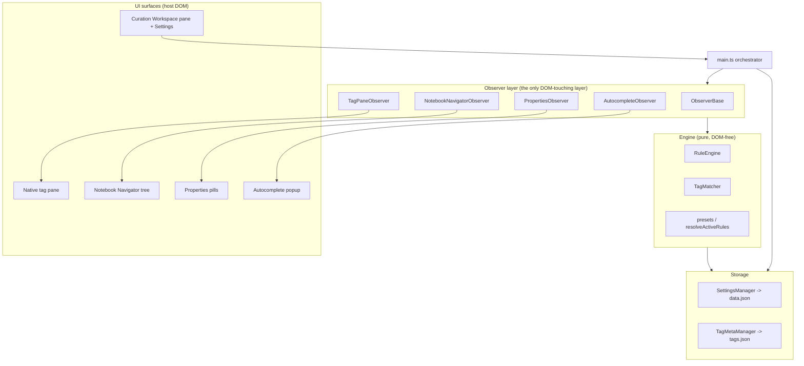
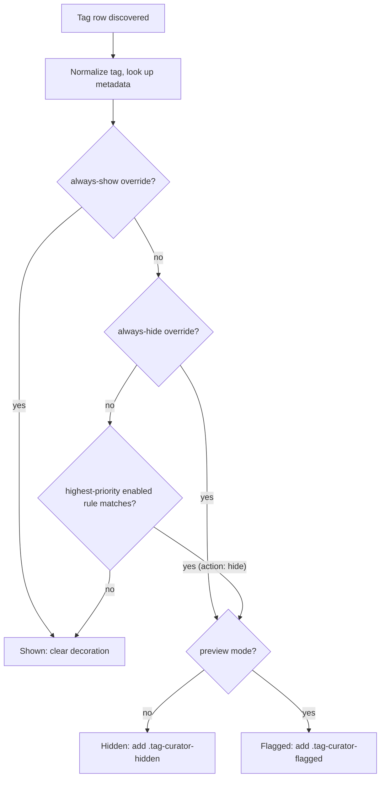
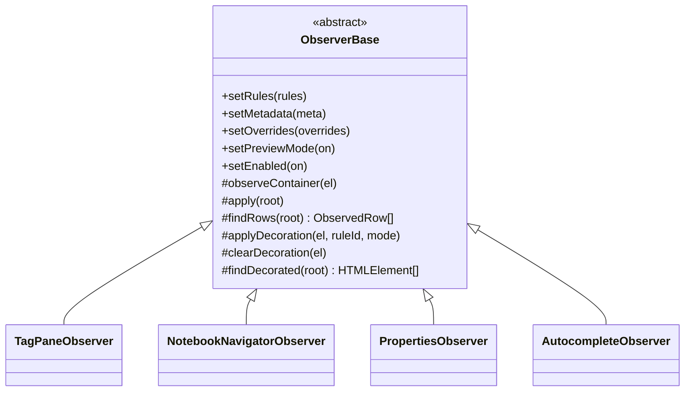
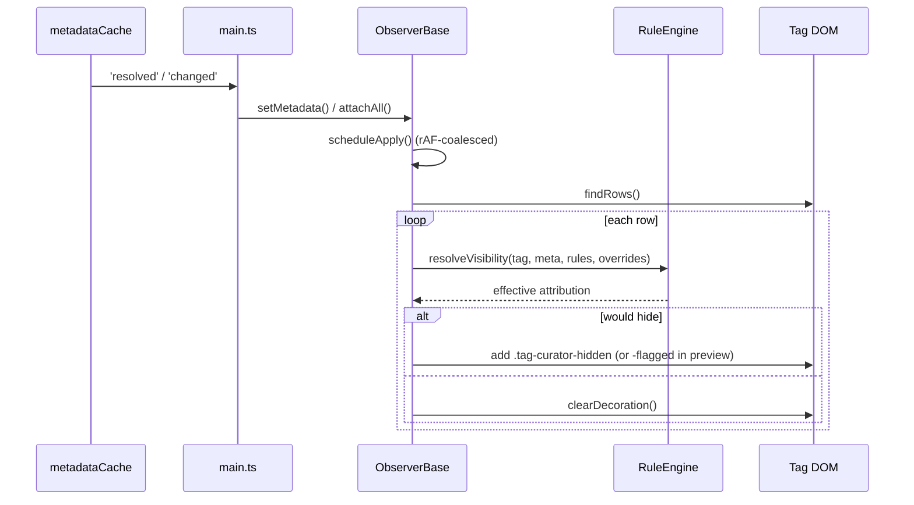

# Architecture

Tag Curator is a **display-only** Obsidian plugin: it changes how tags *render* across Obsidian's UI by toggling CSS classes on existing DOM nodes, and it never edits note content. Disabling or uninstalling it restores every tag. This document is the canonical reference for how the plugin is built; for the contributor workflow see [CONTRIBUTING.md](../CONTRIBUTING.md).

## The prime directive: decorate, never mutate

Every architectural choice follows from one rule: **the plugin must not modify the vault's notes.** It therefore works entirely at the rendered-DOM layer. To hide a tag, an observer adds a Tag-Curator-owned class (for example `.tag-curator-hidden`) to the rendered row, and a CSS rule collapses it with `display: none`. Nothing is removed from the document model, no note is rewritten, and the only persisted state is the plugin's own config plus a metadata sidecar. That single constraint is what makes the plugin fully reversible.

## Layers



Four layers, plus the orchestrator:

- **UI surfaces** - the places tags appear: the native tag pane, Notebook Navigator's tag tree, Properties pills, the editor autocomplete popup, and the plugin's own Curation Workspace pane and Settings tab.
- **Observer layer** - one `ObserverBase` subclass per host surface. Each watches its surface for tag rows and toggles decoration classes. This is the only layer that touches host DOM it does not own.
- **Engine** - pure, DOM-free decision logic. Given a tag, its metadata, the active rules, and the per-tag overrides, it decides whether the tag is shown, hidden, or flagged.
- **Storage** - `SettingsManager` (rules, scope kill switches, per-tag overrides; persisted to `data.json`) and `TagMetaManager` (per-tag count, first seen, last seen, source; persisted to `tags.json`).

`main.ts` wires the layers together and fans shared state out to every observer in one pass.

## Module map

```
src/
  main.ts                       # Orchestrator: lifecycle, command registration, state fan-out
  types.ts                      # Rule, MatchCriteria, TagMeta, TagOverride, Scope, Mode
  engine/                       # Pure decision logic (no DOM, no Obsidian UI)
    matchers.ts                 # TagMatcher: regex / frequency / list matching (+ regex cache)
    ruleEngine.ts               # resolveVisibility, isEffectivelyHidden, countCurated
    presets.ts                  # Built-in presets + resolveActiveRules(settings)
  observers/                    # DOM decoration, one subclass per surface
    observerBase.ts             # Shared lifecycle (MutationObserver, rAF apply, registry)
    tagPaneObserver.ts          # .tag-pane-tag rows
    notebookNavigatorObserver.ts# .nn-tag rows (runtime interop only)
    propertiesObserver.ts       # .multi-select-pill tag pills
    autocompleteObserver.ts     # .suggestion-item tag suggestions
  storage/
    settings.ts                 # SettingsManager: schema-versioned settings + migrations
    tagMeta.ts                  # TagMetaManager: the tags.json sidecar
  integrations/                 # Runtime detection + interop (no source coupling)
    notebookNavigator.ts        # detect + reapply subscription
    notebookNavigatorApi.ts
  ui/
    settingsTab.ts              # Tabbed settings (General, Curate, Scopes, Presets, ...)
    ruleEditor.ts               # Card-based rule editor + live preview
    stateBanner.ts              # Persistent non-default-state banner
    welcomeModal.ts             # First-run onboarding
    panicDisable.ts             # Brute-force DOM sweep across all scopes
    curationWorkspace/          # The dockable Curation Workspace pane + virtualized table
    tagList/                    # Shared tag-table model + actions (pane and settings)
  util/
    safeRegex.ts                # iOS-safe regex compile (rejects lookbehind)
    tagUtils.ts
styles.css                      # All styling (Obsidian theme variables only; no hardcoded colors)
```

## Visibility resolution

For each tag row, the engine resolves a single decision. Per-tag overrides win over rules, and an always-show override is the ultimate safety net.



Precedence, exactly as `RuleEngine.resolveVisibility` implements it:

1. **always-show override** beats everything (the safety net: the user can always force a tag visible).
2. **always-hide override** beats every rule, but yields to always-show.
3. **Rules** otherwise decide. Enabled rules are sorted by `priority` descending and the **highest-priority match wins**.
4. **Preview mode** is a display transform applied last: anything that would be hidden is instead *flagged* (highlighted in place), so the user can see a rule's impact before committing.

## The observer pattern

All four surfaces share one base class. `ObserverBase` owns the generic machinery; each subclass supplies only its surface specifics.



The base owns: a registry of observed containers, a `MutationObserver` per container (watching `childList`, `subtree`, and `characterData`), a `requestAnimationFrame`-coalesced apply loop, the shared rules / metadata / overrides / preview / enabled state, and clear-on-disable plus unload cleanup. Every container is registered with `plugin.register(...)` so its observer disconnects automatically on unload (zero leaks).

| Observer | Host selector | Hide class | Detection |
|---|---|---|---|
| `TagPaneObserver` | `.tag-pane-tag` | `.tag-curator-hidden` | core (always on) |
| `PropertiesObserver` | `.multi-select-pill` | `.tc-prop-hidden` | core (always on) |
| `AutocompleteObserver` | `.suggestion-item` | `.tc-ac-hidden` | core (always on) |
| `NotebookNavigatorObserver` | `.nn-tag` | `.tc-nn-hidden` | runtime-detected; silent no-op if NN absent or too old |

Each scope has an independent kill switch, so a single misbehaving surface can be turned off without disabling the plugin. The effective enabled state of a scope is `globalEnable AND scopeKillSwitch`.

## Decoration lifecycle



## State fan-out

`main.ts` subscribes to `settingsManager.onChange`. On any settings change it recomputes the active rule set (`resolveActiveRules`) and pushes rules, overrides, and preview mode to **every** observer in one loop, then applies each scope's effective enabled state and refreshes the status bar. The same fan-out runs from `onExternalSettingsChange` so an Obsidian Sync rewrite of `data.json` is handled cleanly. The status-bar count comes from the engine (`countCurated`) over tag metadata, not from any one scope's DOM, so toggling a scope off never changes the number.

## Storage

Two files, deliberately split to avoid write races:

- **`data.json`** (`SettingsManager`) - schema-versioned settings: rules, enabled presets, scope kill switches, per-tag overrides, preview/enabled flags, pane state. Migrations are one-way, additive, and guarded; writes are atomic (write-temp-then-rename).
- **`tags.json`** (`TagMetaManager`) - the tag-metadata sidecar: count, first seen, last seen, and source per tag. Writes are debounced (default 5000 ms) to avoid disk churn while editing. This is the plugin's own derived index, not note content.

## Reversibility and safety

- **Class-based hiding only.** Hiding is a CSS class plus a `display: none` rule, never DOM removal. The node stays in the document; the plugin just styles it.
- **Panic disable.** `panicDisable()` directly disables every observer (each clears its own decoration), then brute-force sweeps the whole document for any straggler in all four class namespaces, then flips the master enable off. It works even if a scope's observer is wedged.
- **`onunload`.** Every observer unloads, the metadata manager unloads, and `panicCleanup(document)` sweeps the document, so nothing survives an uninstall.

## Virtualization

Obsidian virtualizes large surfaces (the tag pane and Notebook Navigator's tree) by recycling a small pool of row elements and mutating their text in place as you scroll. Two consequences shape the design:

1. The shared `MutationObserver` watches `characterData`, so when a recycled row's text changes the observer re-evaluates and re-decorates it. Without this a recycled row would keep the prior tag's decoration.
2. On very large vaults (thousands of tags) the core tag pane can still leave a brief stale glyph or gap in the densest regions until the pane re-renders. This is a known limitation tracked for a virtualizer-aware fix; see the Known limitations section of [CHANGELOG.md](../CHANGELOG.md).

## See also

- [CONTRIBUTING.md](../CONTRIBUTING.md) - dev setup, the verification gate, and contribution rules
- [CHANGELOG.md](../CHANGELOG.md) - released changes and known limitations
- [docs/decisions/](decisions/) - architecture decision records (ADRs)
