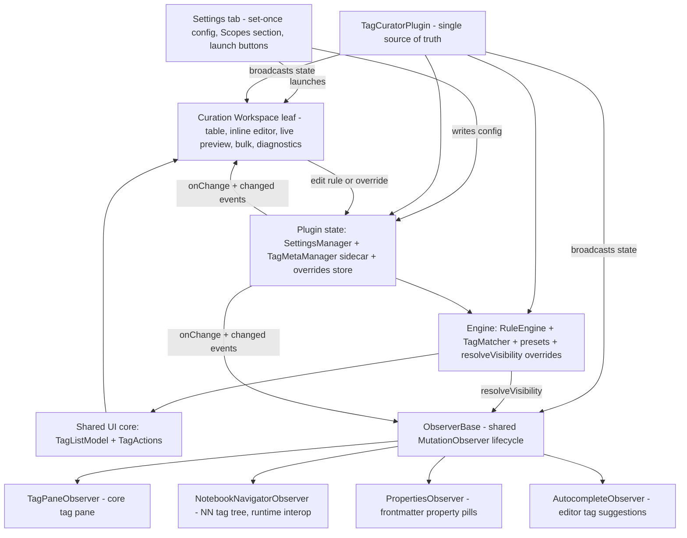

# Tag Curator v1: Technical Architecture

> This document is the **how** for the v1 proposal bundle. It agrees with the
> spine (`01_vision-and-ux-thesis.md`): milestone names are v1.0 "Curation, in
> context", v1.1 "Curation intelligence", v1.2 "Share and scale", v2.0+ "Reach".
> The primary leaf is the **Curation Workspace**. Where this doc adds technical
> detail, it never contradicts Section 7 (milestone map) or Section 8 (cutline).

## 1. Architecture at a glance

The shape of v1.0 is a single source of truth (the plugin object) feeding two
kinds of consumers: the **Curation Workspace** leaf where the user runs the
loop, and the **scope observers** that decorate every surface where tags render.
Settings is now thin config that launches the workspace and toggles scopes.



The loop is the cycle highlighted by the spine: the user edits a rule or sets an
override in the workspace, which writes to plugin state, which broadcasts through
`SettingsManager.onChange` and the `TagMetaManager 'changed'` event to every
observer (so the real tag pane reacts live) and back to the workspace's own
preview. That broadcast wiring already exists in `src/main.ts` (lines 43-76);
v1.0 extends it to four observers instead of one and adds the overrides store.

## 2. Component inventory

| Module | Path | Responsibility | Status |
|---|---|---|---|
| Plugin entry | `src/main.ts` | Lifecycle, command registration, broadcast wiring, status bar | to-refactor (register workspace + 3 new observers + overrides) |
| Types | `src/types.ts` | `Rule`, `MatchCriteria`, `TagMeta`, `TagCuratorSettings`, `Scope`, `Action` | to-refactor (schema v4, `overrides` field) |
| Rule engine | `src/engine/ruleEngine.ts` | `evaluateTag`, `getAllMatches`, `getRuleAttribution` (highest-priority-wins, Q-005) | to-refactor (add `resolveVisibility`) |
| Matchers | `src/engine/matchers.ts` | `TagMatcher.matches` for regex / frequency / list | built (v1.1 adds age, similarity) |
| Presets | `src/engine/presets.ts` | `PRESETS`, `resolveActiveRules` | built |
| Safe regex | `src/util/safeRegex.ts` | Guarded `RegExp` construction | built |
| Tag utils | `src/util/tagUtils.ts` | Tag normalization helpers | built |
| Settings store | `src/storage/settings.ts` | `SettingsManager`, migrations, atomic persist, `onChange` | to-refactor (v3->v4 migration, override CRUD) |
| Sidecar store | `src/storage/tagMeta.ts` | `TagMetaManager`, incremental index, debounced write, `'changed'` event | built |
| Observer base | `src/observers/observerBase.ts` | Shared scoped `MutationObserver` lifecycle, rAF-coalesced apply | to-refactor (route through `resolveVisibility`, per-scope kill switch hook) |
| Tag pane observer | `src/observers/tagPaneObserver.ts` | Decorate `.tag-pane-tag` rows | built |
| NN observer | `src/observers/notebookNavigatorObserver.ts` | Decorate `[data-tag]` rows in `.nn-navigation-pane`; runtime interop | to-build (Phase 3) |
| Properties observer | `src/observers/propertiesObserver.ts` | Decorate frontmatter tag pills in the Properties panel | to-build |
| Autocomplete observer | `src/observers/autocompleteObserver.ts` | Suppress hidden tags in the editor tag-suggestion popup | to-build |
| NN detection | `src/integrations/notebookNavigator.ts` | `detectNotebookNavigator`, version gate, `subscribeReapply` | built |
| NN API type | `src/integrations/notebookNavigatorApi.ts` | Hand-written local `NotebookNavigatorApi` interface | built |
| Tag Wrangler integration | `src/integrations/tagWrangler.ts` | Detection + menu composition | to-build |
| Shared list model | `src/ui/tagList/tagListModel.ts` | `TagListModel`: rows, filter chips, search, sort, selection | to-refactor (overrides-aware visibility) |
| Shared actions | `src/ui/tagList/tagActions.ts` | `TagActions`: bulk, Tag Wrangler delegation, `setVisibility` | to-refactor (light up `setVisibility` via overrides) |
| Curation Workspace | `src/ui/curationWorkspaceView.ts` | `CurationWorkspaceView` `ItemView`: table + editor + preview + bulk + diagnostics | to-build |
| Legacy tag list view | `src/ui/tagListView.ts` | Existing `TagListView` leaf | to-refactor (folds into the workspace; `TAG_LIST_VIEW_TYPE` retired or aliased) |
| Rule editor | `src/ui/ruleEditor.ts` | Card view + docked preview (D-010) | to-refactor (mounts inside the workspace, not Settings) |
| Settings tab | `src/ui/settingsTab.ts` | `TagCuratorSettingTab` | to-refactor (thin: safety row, Scopes, integrations, launch buttons) |
| State banner | `src/ui/stateBanner.ts` | `StateBanner` non-default-state strip | built |
| Welcome modal | `src/ui/welcomeModal.ts` | First-run trust modal (D-008) | to-refactor (copy de-overclaim) |
| Panic disable | `src/ui/panicDisable.ts` | `panicCleanup(document)` | built |

## 3. The Curation Workspace

### 3.1 Why an ItemView, not a Settings tab (D-012)

Obsidian's Settings is a full-screen modal. It draws over the workspace, so any
iterative curation done there hides the very tag pane the user is curating. This
is the modal-occlusion defect the spine names in Section 3.2. A
`PluginSettingTab` cannot escape it, and worse, an `ItemView` cannot mount inside
a `PluginSettingTab` at all (the D-011 revision conceded this, which is why the
v0.1 Settings "Tag list" tab shipped as a stub). D-012 stops fighting the
constraint: the curation loop lives in `CurationWorkspaceView extends ItemView`,
a first-class dockable, splittable leaf that coexists on screen with the tag
pane. Settings becomes a launcher.

### 3.2 Structure of the view

`CurationWorkspaceView` (view type constant `CURATION_VIEW_TYPE`) composes five
regions inside its `containerEl`:

- **Table** - the full tag table (every column from spec 5.3), virtualized.
- **Inline rule editor** - the card view + docked preview from D-010, mounted
  in the leaf rather than Settings. Click a card to edit in place; the `+ New
  rule` card opens edit mode with defaults. The editor never leaves the leaf.
- **Live preview** - as a rule edits, the affected-tags list recomputes and, via
  the broadcast described in 3.3, the real tag pane reacts in the same glance.
- **Bulk bar** - select N tags, then hide / unhide / flag / alias-stub / add
  description / send to Tag Wrangler.
- **Diagnostics** - per-row "why is this hidden?", backed by
  `RuleEngine.getRuleAttribution` (already returns `effective` + `allMatches`).

### 3.3 Rendering from the shared core; state on the plugin

The view owns no tag data. It instantiates one `TagListModel` (per-host view
state: sort, filter, search, selection) and one `TagActions` (operations), both
already merged and headless-tested. `TagListModel.rows()` produces the filtered,
sorted, overrides-aware rows; the view renders them. All durable state - rules,
presets, sidecar meta, overrides - lives on the plugin. A `TagActions` mutation
writes plugin state; the existing subscriptions (`SettingsManager.onChange`,
`TagMetaManager.on('changed')`) re-render both the workspace and every observer.
This is the dual-host state model from the dual-host spec Section 7, generalized:
the workspace is now the single rich host, and the scopes are passive consumers.

### 3.4 The "open beside the tag pane" split

A command - "Open Curation Workspace beside the tag pane" - arranges the
side-by-side loop (D-013). The sequence uses the `WorkspaceLeaf` split API:

1. Reveal or create the native tag pane leaf (`getLeavesOfType('tag')`).
2. Create our leaf with `workspace.getLeaf('split', 'vertical')` (or
   `workspace.createLeafBySplit(tagPaneLeaf, 'vertical')` so the split is anchored
   to the tag pane specifically).
3. `await leaf.setViewState({ type: CURATION_VIEW_TYPE })`, then
   `workspace.revealLeaf(leaf)`.

The default-open path (open-decision #3, recommended right sidebar) reuses the
existing pattern in `main.ts` `openTagList` (`getRightLeaf(false)` then
`setViewState`). If the user prefers a single pane, Preview mode (flag instead of
hide) is the graceful degrade.

## 4. Scope architecture

### 4.1 ObserverBase contract; one observer per scope

`ObserverBase` (`src/observers/observerBase.ts`) owns the generic machinery:
a registry of observed containers, `MutationObserver` wiring scoped to each
container (never `document.body`, per spec 7.2), a `requestAnimationFrame`-coalesced
apply loop, the shared `rules` / `metadata` / `previewMode` / `enabled` state, and
`clearAll` / `unload`. Subclasses implement only four surface-specific hooks:
`init()` (discover containers), `findRows(root)` (locate rows + read tag text),
`applyDecoration(el, ruleId, mode)`, `clearDecoration(el)`, and
`findDecorated(root)`. v1.0 ships four subclasses (D-014): `TagPaneObserver`
(built), `NotebookNavigatorObserver`, `PropertiesObserver`, `AutocompleteObserver`.
The contract is proven by `TagPaneObserver` and the ObserverBase contract tests.

### 4.2 Registration, gating, teardown, per-scope kill switch (D-014)

Each scope is independently registered and toggleable. In `main.ts`, the plugin
holds a map of scope id to observer instance. On load and on
`SettingsManager.onChange`, the plugin reads `defaultScopes` and, for each scope:
constructs and `init()`s the observer if its scope is enabled and not already
running; calls `observer.setEnabled(false)` (which runs `clearAll`) and disconnects
it when the scope is toggled off. `ObserverBase` already registers each
`MutationObserver` disconnect via `this.plugin.register(...)`, so Obsidian tears
everything down on unload. The Settings "Scopes" section is the control surface:
one toggle per scope, each its own kill switch. A flaky scope is switched off
without touching the others (spine principle 11) - breakage is isolated to one
observer because each observes only its own container.

### 4.3 The NN GPL runtime-interop seam

Notebook Navigator is GPL-3.0; Tag Curator is Apache-2.0. The coupling is
**runtime interop only** - never copy, vendor, or adapt NN source (that would
trigger copyleft). Per the findings doc
(`docs/internal/release-plans/proposals/notebook-navigator-compat/findings_nn-integration-seam.md`),
the seam combines two approaches:

- **Hide (Approach A):** `NotebookNavigatorObserver` scopes its observer to
  `.nn-navigation-pane`, watches `.nn-navigation-pane-scroller[data-pane="navigation"]`,
  and decorates `[data-tag]` rows (the canonical lowercase path,
  the single most stable targeting hook). NN's tree is flat, so hiding a parent
  does not hide children: the observer must match descendants too
  (`dataTag === rule || dataTag.startsWith(rule + '/')`). NN's tree is
  TanStack-virtualized and re-renders on scroll, metadata change, settings change,
  and profile switch, so decoration must be **idempotent and reapplied** - via the
  observer plus `subscribeReapply` (already built; re-decorates on `tag-changed`
  and `storage-ready`).
- **Flag (Approach B):** where a flag is a color/background/icon, prefer the
  public API `nn.metadata.setTagMeta(...)` so NN renders it and it survives
  re-renders.

Decoration uses Tag-Curator-namespaced classes/attributes (never `nn-*`); on
unload the observer disconnects, removes all `tc-*` decorations, and clears any
`setTagMeta` it set. The NN scope is gated by `detectNotebookNavigator` (returns
`absent` / `too-old` / `ready` against `MIN_API_VERSION = '2.0.0'`): absent is a
silent no-op, too-old shows a one-time notice and skips the scope.

### 4.4 Autocomplete + properties DOM-path risk and isolation

Autocomplete and Properties DOM paths are undocumented and shift across Obsidian
versions (spine risk table; D-014 context). The isolation strategy:

- Each ships **default-on but per-scope kill-switchable**, so a path break
  degrades to "turn off that one scope," never "disable the plugin."
- Both extend `ObserverBase`, so a thrown selector or a missing container is
  contained to that observer's `apply` pass; `findRows` returning `[]` is a safe
  no-op (the base skips empty rows).
- The autocomplete observer suppresses entries rather than restyling them:
  `findRows` reads the suggestion popup items and `applyDecoration('hidden')`
  collapses an entry whose tag is hidden, stopping a user re-creating a tag they
  just hid (spine cutline item 5).
- Each scope is smoke-tested on `manifest.json` `minAppVersion` before release.

## 5. Engine and resolution order

### 5.1 Rule attribution (highest-priority-wins, Q-005)

`RuleEngine.evaluateTag` sorts enabled rules priority-descending and returns the
first match; `getRuleAttribution` returns that winner as `effective` plus the
full `allMatches` chain. This is the Q-005 fix (highest priority wins, not last
match) and powers the diagnostics column unchanged.

### 5.2 The new override resolution (D-015)

v1.0 adds a new entry point, `RuleEngine.resolveVisibility(tag, meta, rules,
overrides)`, that checks the overrides store **before** rule attribution.
Precedence:

1. **`overrides[tag] === 'show'`** -> always shown (the safety override the spec
   promises). Beats every rule.
2. **`overrides[tag] === 'hide'`** -> always hidden. Beats every rule **except**
   an always-show on the same tag (which cannot co-occur; the store holds one
   value per tag).
3. Otherwise fall through to `evaluateTag` / `getRuleAttribution` (rules + presets).
4. No match -> shown.

```
resolveVisibility(tag):
  overrides[tag] == 'show'  -> SHOWN   (safety override; wins over everything)
  overrides[tag] == 'hide'  -> HIDDEN  (wins over rules)
  else                      -> rule attribution (highest-priority-wins)
  else                      -> SHOWN
```

`ObserverBase.apply` switches from calling `evaluateTag` directly to calling
`resolveVisibility`, so every scope honors overrides identically.
`TagListModel.allRows` and `TagActions.setVisibility` (today returning the
`b009` deferred stub) light up against the same store. This is the change that
makes the workspace's per-row actions real.

## 6. Data model evolution

### 6.1 Current model (schema v3)

`Rule` (id, name, enabled, priority, `match: MatchCriteria`, action, scopes,
notes, builtin); `MatchCriteria` (type `regex | frequency | list`, pattern,
operator, value, list); `TagMeta` (tag, firstSeen, lastSeen, count, sources,
description?, aliases?, reviewed?); `TagCuratorSettings` (schemaVersion=3,
enabled, mode, defaultScopes, enabledPresets, customRules, previewMode, debugLog,
sidecarDebounceMs, seenWelcomeModal).

### 6.2 The v1.0 addition: overrides (schema v4)

Add one field to `TagCuratorSettings`:

```ts
overrides: Record<string, 'show' | 'hide'>;  // tag (no leading #) -> decision
```

Overrides are first-class settings, **not** sidecar data, because they are user
intent (a decision) and the sidecar is rebuildable from the metadata cache - a
decision stored there could be lost on rebuild (D-015 approach C rejected). They
are not encoded as auto-generated rules (approach A rejected: pollutes the rule
set and conflates attribution). `SettingsManager` gains
`setOverride(tag, 'show' | 'hide' | null)` (null clears) alongside the existing
atomic persist + `onChange` broadcast.

### 6.3 Migration table (v0 to v4)

| From -> to | What changes | Guard |
|---|---|---|
| v0 -> v1 | Fold legacy `enabledRules[]` into each rule's `enabled` flag | `inferred < 1` branch in `migrate` |
| v1 -> v2 | Rename `dryRun` -> `previewMode`, carry value verbatim | `inferred < 2` branch |
| v2 -> v3 | Add `seenWelcomeModal` (defaults false; existing testers see the modal once) | `inferred < 3` branch |
| v3 -> v4 | Add `overrides: {}` (one-way guarded; defaults to empty) | new `inferred < 4` branch |

Migration only persists when migrating **up** (`incomingVersion < SCHEMA_VERSION`),
so reading a future-version file with an older plugin never downgrades on disk
(the guard already in `SettingsManager.load`). Tests cover v3->v4 and the
override precedence (D-015 status).

### 6.4 Seams for v1.1 and v1.2 (so v1.0 does not paint a corner)

- **v1.1 age / similarity match types.** `MatchType` is the extension point.
  Adding `'age'` and `'similarity'` to the union, with `TagMatcher` cases that
  read `TagMeta.lastSeen` (age) or compute edit distance (similarity), is purely
  additive - no schema change for age, since `lastSeen` already exists.
- **v1.1 aliases resolution.** `TagMeta.aliases` already exists in the type. v1.1
  adds an alias-resolution pass in the observer pipeline (collapse aliases under a
  canonical before decoration); v1.0 leaves the field unread, so no migration is
  owed and the seam is clean.
- **v1.2 compound criteria (`MatchNode`).** The compound AND/OR/NOT tree replaces
  the flat `MatchCriteria`. v1.0 keeps `Rule.match` a single `MatchCriteria` and
  isolates matching behind `TagMatcher.matches(tag, meta, criteria)`. v1.2 swaps
  that one call for a recursive `MatchNode` evaluator and migrates v4->v5 by
  wrapping each flat criteria in a single-leaf node. Because the engine's public
  surface (`evaluateTag`, `resolveVisibility`) does not expose `MatchCriteria`
  shape, the swap is contained.

## 7. Performance

The spine's success criteria and spec 7.5 set the budget: 10k notes / 1,500 tags
/ 30 rules, idle near-zero CPU, initial sweep under 200 ms, smooth table scroll.
The architecture meets it as follows:

- **Virtualized table.** The Curation Workspace table renders only on-screen rows.
  At 1,500 tags this is the difference between a smooth and a janky scroll.
- **Scoped, debounced observers.** Each `MutationObserver` is scoped to its own
  container, never `document.body`. The base coalesces repeated apply requests
  into a single `requestAnimationFrame`, so a burst of mutations is one apply pass.
- **Incremental sidecar.** `TagMetaManager` indexes per changed file on
  `metadataCache.on('changed')` and debounces writes (default 5000 ms, configurable
  via `sidecarDebounceMs`). No full rescan on every keystroke.
- **Engine cost.** Evaluation is O(M*R) (M tags, R rules); the override check is
  O(1) per tag (a `Record` lookup) and short-circuits before rule iteration, so
  pinned tags cost less, not more.
- **Lazy O(n^2) similarity deferred to v1.1.** Near-duplicate detection is
  pairwise (O(tags^2)); it is explicitly a v1.1 feature (spine Section 8.2), and
  when it lands it will compute lazily (on demand in the suggested-merges panel),
  never on every observer pass.

## 8. Integration points

All integrations are optional enhancements, never dependencies (D-016).

- **Style Settings.** Ship a `/* @settings */` comment block in `styles.css`
  exposing Tag Curator's CSS variables and classes. No JavaScript: the variables
  carry built-in defaults, so nothing breaks if Style Settings is absent. Themes
  and power users restyle the hidden/flagged treatment without touching code
  (cutline item 9, ~80 lines of CSS comments).
- **Tag Wrangler.** Detect via `app.plugins.enabledPlugins.has('tag-wrangler')`
  (the existing `TagActions.tagWranglerInstalled` path). When present, compose
  items into Tag Wrangler's tag context menu and enable the bulk "Send to Tag
  Wrangler" action (which dispatches `tag-wrangler:rename-tag` per tag, as
  `TagActions.sendToTagWrangler` already does). When absent, fall back to Tag
  Curator's own context menu, with the bulk button disabled and an explanatory
  tooltip. Renaming always delegates - Tag Curator never writes note content.
- **Notebook Navigator.** Detection and version-gate are built
  (`detectNotebookNavigator`, `MIN_API_VERSION`). Absent is a silent no-op; ready
  enables the runtime-interop observer (Section 4.3).

## 9. Testing strategy

- **Headless unit tests (vitest + happy-dom).** The pure layer is fully testable
  without an Obsidian leaf - the reason the shared core was extracted.
  `TagListModel`: row-building, each filter chip, search predicate, comparator
  across every `SortKey`. `TagActions`: `sendToTagWrangler` dispatch count, and
  `setVisibility` against the overrides store once D-015 lands. `RuleEngine`:
  `evaluateTag`, `getRuleAttribution`, and the new `resolveVisibility` precedence
  (always-show beats all; always-hide beats rules; fall-through). Migrations:
  v3->v4 adds `overrides: {}`, and the up-only persist guard.
- **Synthetic-DOM observer tests.** Each `ObserverBase` subclass gets contract
  tests via a minimal synthetic DOM (the pattern already used for the ObserverBase
  contract tests): build a fake container with the surface's row markup
  (`.tag-pane-tag`, `[data-tag]` rows, property pills, suggestion items), drive
  `findRows` / `applyDecoration` / `clearDecoration`, and assert idempotent
  re-decoration. NN tests use synthetic `.nn-navigation-pane` markup matching the
  findings doc; no NN source is imported (only the local API type).
- **Human-only: BRAT smoke matrix.** Live-Obsidian behavior - the split command
  arranging panes, real virtualization in NN's tree, autocomplete suppression in
  the editor, the welcome modal first-run - is verified by a manual BRAT smoke
  sweep on `minAppVersion` and current Obsidian, with NN installed and absent.
  These cannot be asserted headlessly and are gated by a human before tagging.

## 10. Risks and open technical questions

- **Autocomplete / properties DOM paths are undocumented.** Mitigated by per-scope
  kill switches (D-014), `ObserverBase` isolation, and `minAppVersion` smoke
  tests. Open: exact selectors for the suggestion popup and property pills need
  to be read from a running instance during Phase build.
- **NN virtualization wipes decorations.** Mitigated by idempotent re-decoration
  via the observer plus `subscribeReapply`. Open: confirm `tag-changed` /
  `storage-ready` fire frequently enough that no flicker is visible on fast scroll;
  if not, also observe the scroll container directly (already the recommended seam).
- **Override store migration could corrupt settings.** Mitigated by atomic
  write-temp-then-rename (in place), one-way guarded migration, and v3->v4 tests.
- **Workspace retiring `TAG_LIST_VIEW_TYPE`.** The legacy `TagListView` leaf and
  view type must either be aliased to the new `CurationWorkspaceView` or migrated,
  so existing BRAT testers with the old leaf in their saved workspace layout do
  not get an orphaned pane. Open: alias vs migrate on first load.
- **Split command on mobile.** The `WorkspaceLeaf` split API behaves differently
  on mobile (no side-by-side); the command should degrade to opening the workspace
  full-leaf with Preview mode suggested. Open: confirm mobile behavior in the BRAT
  matrix.
- **Tag Wrangler menu event signature.** Composing into Tag Wrangler's tag menu
  depends on its menu hook; the bulk command-dispatch path is the stable fallback.
  Open: verify the current Tag Wrangler menu-composition API at build time.
