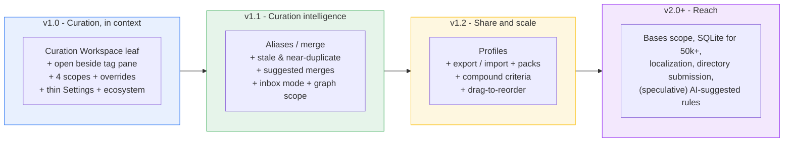

# Tag Curator v1: The Journey, for People

> This is the human half of the roadmap. Its job is to help you decide
> **whether** to build v1 and **why** it is shaped this way. It is not an
> execution checklist - that is `05_roadmap_agent.md`. Everything here agrees
> with the spine (`01_vision-and-ux-thesis.md`): the milestone map is its
> Section 7, the v1.0 cutline is its Section 8, and the vocabulary is its
> Section 5.1.

## 1. The pain, told plainly

You are looking at your tag pane. It has 1,500 tags in it, and maybe 400 of
them are noise: hex codes a web clipper dropped in, `#ai` and `#AI` and `#Ai`
that should be one thing, a Templater fragment, a tag you used exactly once in
2023. You want to clean it up. So you open Tag Curator and start writing a rule
to hide the junk.

And here is the moment the current design breaks. Obsidian's Settings is a
**full-screen modal**. The instant it opens, it draws over your entire
workspace - including the tag pane you are trying to fix. The thing you are
curating is now hidden behind the thing you are curating it with. So the loop
becomes a stutter:

```
open Settings -> write a rule -> (can't see the tag pane) -> close Settings to look
   -> "that hid one too many" -> reopen Settings -> adjust -> close -> look -> ...
```

Preview mode (flag instead of hide) takes the danger out of that loop, but not
the friction. You still cannot watch the result while you make the change. You
are editing blind and checking your work afterward, every single time.

This is not a quirk of Tag Curator. It is the most common architectural mistake
in Obsidian plugin UX, and the plugins people love most all dodge it the same
way: they put their interactive surface in a **workspace leaf** - a real,
dockable, splittable pane that lives alongside everything else. Search,
Backlinks, Outline, Kanban, Canvas, Dataview tables: all leaves, never buried in
a modal.

## 2. The fix, in one sentence

> **Move the active curation loop out of the Settings modal and into a
> Curation Workspace leaf that sits beside the tag pane, so you see every change
> land in real time. Settings keeps only the things you set once.**

You open the Curation Workspace next to the native tag pane with one command.
You write a rule on the left. The matched tags update on the left, and the real
tag pane updates on the right, as you type. The open-tweak-close-look-reopen
stutter collapses into a single continuous glance. That glance is the entire
product.

The good news, and the reason this is a roadmap and not a rewrite: the hard part
is already built. The rule engine, the schema-versioned storage, the
`ObserverBase` pattern, and the shared `TagListModel` / `TagActions` core are
done and tested (154 tests, green CI). v1 is mostly assembling proven parts into
the right surface, plus a handful of cheap, well-understood additions.

## 3. The journey at a glance



| Milestone | Theme | One-line promise |
|---|---|---|
| **v1.0** | Curation, in context | The workspace beside the tag pane, the scopes that make "where tags live" feel complete, and the trust layer that earns adoption. |
| **v1.1** | Curation intelligence | The plugin starts helping: it spots duplicates and stale tags, suggests merges, and gives new tags an inbox. |
| **v1.2** | Share and scale | Your curation becomes portable: profiles, shareable rule packs, and compound logic for power users. |
| **v2.0+** | Reach | Bigger vaults, more surfaces, more languages, the community directory. Out of this bundle; listed so nothing is lost. |

The ordering has a logic: **v1.0 is thesis plus completeness plus trust**,
**v1.1 is intelligence on top of a finished surface**, **v1.2 is portability and
power as multipliers**. Each later milestone wants the earlier one to exist
first. Intelligence (suggested merges, inbox) literally needs a workspace to live
in; sharing (rule packs) only matters once the single-vault experience is great.

## 4. v1.0 - "Curation, in context"

This is the release the whole bundle is arguing for. Eleven items, each grounded
in something already built or something cheap and well understood. Below, each
item gets a "what it is / why it matters / what you feel."

### The eleven, walked

**1. The Curation Workspace leaf.** *What it is:* one dockable pane holding the
tag table (count, first/last seen, source, per-scope visibility, the affecting
rule, alias, description; sortable, filterable, searchable, virtualized), the
inline card-based rule editor, a live preview, bulk actions, and inline "why is
this hidden?" diagnostics. *Why it matters:* it is the thesis. Every other item
either feeds it or extends it. *What you feel:* one place that is obviously
"where I curate," not a settings screen you tolerate.

**2. "Open beside the tag pane" command.** *What it is:* a single command that
opens the workspace, reveals the native tag pane, and arranges them as a split.
*Why it matters:* it delivers the side-by-side loop that *is* the UX win, without
asking the user to learn Obsidian's pane management. *What you feel:* you type a
rule and watch the tag pane react, live, in the same breath.

**3. Scope: Notebook Navigator tag tree.** *What it is:* Tag Curator's hide/flag
decisions extend into Notebook Navigator's tag tree. *Why it matters:* NN is the
highest-traffic third-party tag surface; a tag you hid that still shows there
feels broken. *What you feel:* consistency - the tag is gone in both places.
(Already in flight on `feat/nn-compat-phase1`; runtime-interop only, never
copying NN's GPL source.)

**4. Scope: Properties panel.** *What it is:* the same hide/flag treatment for
frontmatter tags shown in the Properties panel. *Why it matters:* it is a primary
place tags render, and it is cheap to cover because it rides the proven
`ObserverBase`. *What you feel:* no surprising leak of a tag you thought you hid.

**5. Scope: Autocomplete suppression.** *What it is:* a hidden tag stops being
suggested in the editor's tag autocomplete. *Why it matters:* it closes the loop
- without it, you hide a tag and then accidentally re-create it five minutes
later. *What you feel:* the junk stays gone instead of creeping back.

**6. Per-tag overrides (always-show / always-hide).** *What it is:* a persisted
per-tag decision that beats every rule - pin one tag to always show, or hide one
without writing a rule. *Why it matters:* it makes the workspace's per-row
actions *real* (they are inert today, B009), and always-show is the safety net
the spec has always promised. *What you feel:* total control over the one tag in
front of you, and the confidence that you can always claw a tag back.

**7. Thin Settings + a "Scopes" section + launch buttons.** *What it is:*
Settings stops being a workbench and becomes set-once config: the safety row,
which scopes are active, integrations, advanced knobs, and a prominent "Open
Curation Workspace" button. *Why it matters:* it removes the
Settings-as-workbench anti-pattern that caused the original pain. *What you feel:*
Settings is calm and rare; the work happens in the leaf.

**8. Trust layer polish.** *What it is:* de-overclaimed welcome copy, the
non-default-state banner, panic disable, and the status bar. *Why it matters:*
trust is the adoption gate, and the v0.1 welcome copy currently overclaims. *What
you feel:* within thirty seconds you believe the file-safety promise, because it
is stated plainly and it is true.

**9. Style Settings registration.** *What it is:* an `@settings` block in
`styles.css` so themes and power users can restyle the workspace without code.
*Why it matters:* near-free (~80 lines of CSS comments) and it makes Tag Curator
a good theme citizen. *What you feel:* it looks like it belongs in your vault.

**10. Tag Wrangler menu composition + bulk delegation.** *What it is:* when Tag
Wrangler is present, Tag Curator composes into its menu and offers a bulk "send to
Tag Wrangler" action; when absent, it degrades gracefully. *Why it matters:* Tag
Curator is display-only, so actual renames belong to Tag Wrangler - this is the
clean handoff. *What you feel:* the two plugins feel designed to work together.

**11. Compatibility doc (Dataview / Tasks / Bases unaffected).** *What it is:* an
explicit written promise that query plugins see the full, unfiltered tag set.
*Why it matters:* the display-only contract is the trust story; saying it out loud
prevents a category of fear. *What you feel:* certainty that hiding a tag from
view never breaks a Dataview query or a Task filter.

### Why these eleven, and not more

The temptation in a "feature-rich v1" is to add aliases, intelligence, and
sharing now. The cutline (spine Section 8) holds the line on purpose: each v1.0
item is in *because* it rides built infrastructure or is cheap and understood,
and each deferral has a one-line reason. Aliases and intelligence are genuinely
high-value, which is exactly why they get their own themed release (v1.1) instead
of diluting the one that has to land the thesis.

## 5. v1.1 - "Curation intelligence"

Once the workspace exists and the scopes are solid, the plugin can start *helping*
rather than just *obeying*. The theme is the surface getting smart.

| Feature | What it adds | Why it is here, not in v1.0 |
|---|---|---|
| Aliases / display-merge (H) | Collapse `#AI` / `#Ai` / `#ai` under one canonical, display-only; rename via Tag Wrangler | Highest-value deferred feature (B006), but it needs an alias-resolution pass in every scope observer plus a merge UI - cleaner to build on a finished surface (D-017). |
| Stale + near-duplicate match types (I) | New `age` and `similarity` match types, plus a stale preset | Engine extension; the new match types want a stable engine and a workspace to surface in. |
| Suggested-merges panel (I) | Proactively proposes "these three are probably one tag" | This panel's natural home is the workspace, so the workspace must exist first. |
| Inbox mode (J) | New tags land in a review queue until accepted / hidden / merged | A mode with its own queue; best built once overrides and the workspace are solid. |
| Graph view scope (K) | Hide / flag tag nodes in the global and local graph | Higher DOM-observer risk (canvas/SVG); not load-bearing for the thesis, so it waits. |

**The one-line why-later:** v1.1 is everything that makes curation *intelligent*,
and intelligence is most valuable once there is a great place to act on it.

## 6. v1.2 - "Share and scale"

Now the experience is great in one vault. v1.2 makes it portable and gives power
users their depth.

| Feature | What it adds | Why it is here, not earlier |
|---|---|---|
| Profiles (L) | Switchable rule-sets ("Writing", "Curation", "Demo"), with NN profile sync | A multiplier on a stable rule model, not a prerequisite. |
| Export / import + community packs (M) | Share rule-sets across vaults and with the community | Needs a trust and index model; ship the great single-vault experience first. |
| Compound criteria + drag-to-reorder (N) | AND/OR/NOT rule trees and a visible priority UI | Engine model change (`MatchCriteria` -> `MatchNode`) plus migration; single-criterion rules are pleasant enough in the workspace to wait. |

**The one-line why-later:** sharing and compound logic multiply an experience
that is already excellent; they do not create one.

## 7. A day in the life

It is a Tuesday. Jordan has been clipping research articles for months and the
tag pane has become a junk drawer.

Jordan runs **"Open Curation Workspace beside the tag pane."** The workspace slides
in on the left; the native tag pane sits on the right. No modal, nothing hidden.

In the workspace, Jordan clicks `+ New rule`, picks the regex match type, and
starts typing a pattern to catch the hex-code tags the clipper left behind:
`^[0-9a-f]{6}$`. As the characters land, two things move at once. The matched-tags
list inside the workspace fills in, and over on the right the native tag pane's
`#a1b2c3` and `#ffeedd` quietly **vanish, live**. Jordan watches it happen and
thinks "yes, that is exactly the set I meant" - no closing, no reopening, no
guessing.

One tag, `#abcdef`, is actually a real project code, not a color. Jordan finds its
row, clicks the per-row action, and **pins it to always-show**. It pops back into
the tag pane and will never be caught by a rule again. That is the override safety
net doing its job.

Two tags, `#ai` and `#AI`, are obviously the same idea. Jordan selects both,
opens the bulk menu, and chooses **"Send to Tag Wrangler"** to do the real rename
- Tag Curator hands the actual file-touching work to the tool that owns it, and
stays display-only and file-safe.

Total elapsed time: under two minutes, one continuous glance, zero context
switches, nothing written to a single note. That is "curation, in context."

## 8. Risks and how we handle them

The spine's Section 10 names the risks; here is the fuller version with the
real mitigation in each case.

**Undocumented DOM for autocomplete and properties.** These surfaces are not part
of Obsidian's public API, and their internal markup can shift between releases. We
mitigate three ways: every scope ships behind its own per-scope kill switch
(D-014), so a broken scope can be turned off without disabling the plugin;
`ObserverBase` isolates each scope so breakage in one cannot cascade; and we
smoke-test against `minAppVersion` before release. The user is never stranded by
one flaky surface.

**Notebook Navigator is GPL-3.0; Tag Curator is Apache-2.0.** Copying NN source
would be a license violation. We never do. The integration is runtime-interop
only: we observe and decorate NN's rendered DOM and call its public API, and we
copy none of its code (established 2026-05-30). NN's absence is a silent no-op.

**The override migration could corrupt settings.** Adding the `overrides` store
bumps the schema v3 -> v4. The migration is one-way and guarded, defaulting
`overrides` to `{}`; writes use the atomic write-temp-then-rename already in place;
and the v3 -> v4 path plus the precedence rules (always-show beats every rule;
always-hide beats every rule except always-show) are covered by tests before
release.

**Scope creep balloons v1.0.** The Section 8 cutline is canonical and each
deferral has a written reason. Aliases and intelligence are explicitly v1.1. The
discipline is the same one the master `scope-and-decisions.md` already enforces:
ambitious, but every item grounded.

**The side-by-side win depends on the user arranging panes.** Most users will
never discover the split on their own. So we ship the one-click "open beside the
tag pane" command and make it the recommended path in onboarding. For users who
prefer a single pane, Preview mode (flag instead of hide) is the graceful
degrade - they still see what would change before it does.

## 9. What "great" looks like

Adapted from the spine's Section 9 into outcomes you could actually check:

| Outcome | How you would know |
|---|---|
| The loop is frictionless | A user writes a rule and watches the tag pane react without ever opening Settings. |
| Tags are tamed everywhere | Hiding a tag removes it from the tag pane, NN, properties, and autocomplete - the four places it appears. |
| Nothing is ever lost | Status bar count, the Hidden filter chip, per-row "why hidden?", and one-click always-show mean "where did my tag go?" never happens; uninstalling restores everything instantly. |
| Trust lands in 30 seconds | The welcome modal's first claim is file-safety, and it is literally true: zero note-content writes, ever. |
| It is fast on a real vault | On 10k notes / 1,500 tags / 30 rules: near-zero idle CPU, initial sweep under 200 ms, smooth virtualized scroll. |
| It is a good ecosystem citizen | Dataview / Tasks / Bases see unfiltered tags; Tag Wrangler owns renames; Style Settings can restyle it; NN coexists cleanly. |

## 10. The decisions in front of you

These four calls change the build. The recommendation is the default; saying
**"go"** without comment accepts all four.

| # | Decision | Recommendation | If you want otherwise |
|---|---|---|---|
| 1 | **v1.0 scope size** | Ship all 11 items. | For a faster v1.0, move autocomplete (item 5) and/or properties (item 4) to v1.1. Workspace + overrides + NN alone still delivers the thesis. |
| 2 | **Aliases timing** | v1.1 (D-017). | If aliases matter more to you than scope breadth, swap aliases into v1.0 and push autocomplete to v1.1. |
| 3 | **Workspace default location** | Opens in the right sidebar (familiar, coexists with the tag pane), with the "open beside" command for the power split. | Open in the main editor area instead. |
| 4 | **Naming** | "Curation Workspace." | "Tag Studio," "Curation Board," or "Tag Curator panel" - a rename is a find-replace; the docs use "Curation Workspace" throughout. |

My honest read: the full 11-item v1.0 is the right call. The expensive,
load-bearing parts (engine, observer base, shared core) are done; the net-new
work (the leaf assembly, two cheap scopes, the override store, thin Settings, two
small ecosystem hooks) is grounded and bounded. Trimming scopes would buy a little
speed at the cost of the "tamed everywhere" promise that makes the release feel
finished. Aliases genuinely belongs in v1.1, where it gets a themed home next to
near-duplicate detection rather than competing for attention in the release that
has to land the thesis.

## 11. How to say go

If this reads right, the green light is simple: **say "go" and point an agent at
`05_roadmap_agent.md`.** On "go", the agent promotes the proposed decisions
(D-012..D-017) from `02_decisions_v1.md` into the master
`scope-and-decisions.md`, then executes `05_roadmap_agent.md` phase by phase
behind the project's existing verification gates
(`npm run lint && npm run typecheck && npm test && npm run build`).

This document and the agent plan describe the **same** scope and the **same**
milestones. This one is for deciding whether and why. That one is for building
what and how. If you want a different shape, the four decisions in Section 10 are
the dials; turn any of them and the agent plan follows.
